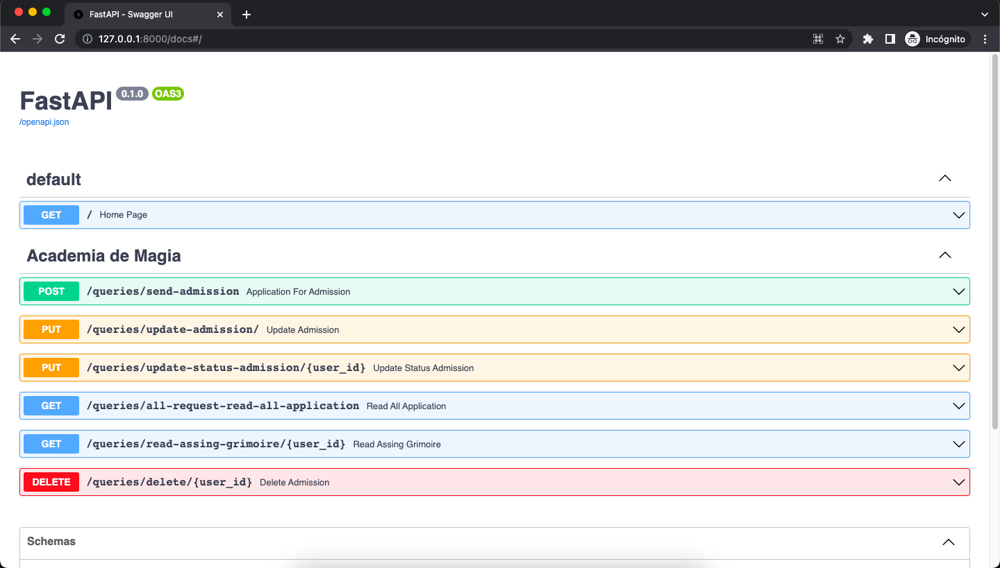

# Reino_del_Trebol

Api construida con fastApi para simulador el mundo del Reino del Trebol, donde se requiere diseñar un sistema para una academia de magia.


### Ambiente: 

En el Reino del Trébol, El Rey Mago requiere diseñar un sistema para la academia de magia; este debe realizar el registro de solicitud del estudiante y la asignación aleatoria de su Grimorio. 

El nivel de estos Grimorios está categorizado por el tipo de trébol en la portada:

    * Sinceridad – Trébol de 1 hoja.
    * Esperanza – Trébol de 2 hojas.
    * Amor – Trébol de 3 hojas.
    * Buena Fortuna - Trébol de 4 hojas.
    * Desesperación – Trébol de 5 hojas.

Los estudiantes tendrán una de las siguientes afinidades de magia:

    * Oscuridad
    * Luz
    * Fuego
    * Agua
    * Viento
    * Tierra

### Instrucciones:

Para este requerimiento se requiere exponer un API Rest, construida con las herramientas
antes mencionadas.
Deben exponerse a través de Postman o Swagger los endpoints necesarios para soportar
las siguientes operaciones:

* Enviar solicitud de ingreso.
* Actualizar solicitud de ingreso.
* Actualizar estatus de solicitud.
* Consultar todas las solicitudes.
* Consultar asignaciones de Grimorios.
* Eliminar solicitud de ingreso.

Una vez aprobada la solicitud se debe realizar la auto asignación de Grimorio y de portada.
Las solicitudes de ingreso deben indicar como mínimo los siguientes datos del aspirante:

* Nombre (solo letras, máximo 20 caracteres).
* Apellido (solo letras, máximo 20 caracteres).
* Identificación (números y letras, máximo 10 caracteres).
* Edad (solo números, 2 dígitos).
* Afinidad Mágica (mencionadas anteriormente).

Al incumplir cualquiera de estos criterios automáticamente la solicitud queda rechazada y
no se debe asignar Grimorio.

## Funcionalidades



## Endpoint
1. application_for_admission (POST) -> Enviar solicitud de ingreso.
2. update_admission (PUT) -> Actualizar solicitud de ingreso.
3. update_status_admission (PUT) -> Actualizar estatus de solicitud.
4. read_all_application (GET) -> Consultar todas las solicitudes.
5. read_assing_grimoire (GET) -> Consultar asignaciones de Grimorios.
6. delete_admission (DELETE) -> Eliminar solicitud de ingreso.

## Requisitos
1. Python 3.10.7
2. FastApi 0.92.0
3. Pydantic 1.10.5
4. SQLAlchemy 2.0.4

5. IDE: Visual Studio 2022 / Visual Code / PyCharm
6. Base de datos: SQL / MySQL / Postgresql / MongoDB / CouchDB / Redis / MariaDB
7. Postman (para pruebas).
## Instalación
1. Clonar el repositorio
    ```
    git clone https://github.com/migherize/Reino_del_Trebol.git

    ```
2. Instalar dependencias
    ```
    cd Reino_del_Trebol
    pipenv install
    pipenv install -r requirements.txt
    ```
3. Variables de entorno
    - `name_serviceDB`: El host de la base de datos utilizada por la aplicación.
    - `DB`: El puerto de la base de datos utilizada por la aplicación.
    - `userDB`: Usuario de base de datos utilizada por la aplicación.
    - `passwordDB`: Contraseña de base de datos utilizada por la aplicación.
    - `nameBD`: Nombre de la base de datos utilizada por la aplicación.
    - `port`: El puerto de la base de datos utilizada por la aplicación.

    #### Ejemplo .env
    ```
    touch .env
    ```
    ```
    # .env

    DB = "mysql+pymysql"
    userDB="root"
    passwordDB="password"
    name_serviceDB="localhost"
    nameBD="name_database"
    port="3306"
    ```

## Uso
1. Ejecutar el proyecto

    ```
    uvicorn app.main:app --reload
    ```
2. Acceder a http://127.0.0.1:8000/docs
2. Documentacion mas detallada http://127.0.0.1:8000/redoc

## Contribución
1. Fork del repositorio
2. Crear una rama

    ```
    git checkout -b feature/nueva-funcionalidad
    ```